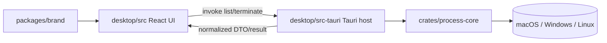

# feat: Establish Tauri desktop foundation

## Overview

为仓库建立第一版可运行的桌面应用基础设施：以 `desktop/` 作为 Tauri 2 主应用模块，以 `packages/brand/` 作为共享品牌资源模块，并补齐前端 UI、Rust 系统能力层、进程管理核心、基础测试与文档约定。

本计划只覆盖桌面端首期 MVP：**展示运行中应用/进程、搜索筛选、结束进程、反馈失败原因**。未来移动端、托盘常驻、开机启动、自动更新不在本轮实施范围内。

## Problem Frame

当前仓库已经完成技术选型与模块命名，但仍停留在文档与占位阶段，缺少真正可运行的 Tauri 工程骨架、前后端边界、共享资源接入方式，以及“进程列表 -> 用户确认 -> 结束进程 -> 刷新反馈”的完整实现路径。

这个项目的关键不是单纯起一个前端壳，而是要把三类东西同时定稳：

- 桌面宿主结构：`desktop/` 下的 Tauri + Web UI 工程边界
- 系统能力结构：跨平台进程枚举与结束进程的 Rust 实现边界
- 仓库演进结构：根目录主应用、`packages/brand/` 公共资源、未来可扩展的 Rust 核心模块

以上方向已在 origin 中明确（见 `docs/brainstorms/2026-07-22-cross-platform-desktop-tech-selection-requirements.md`），本计划定义如何实施。

## Requirements Trace

- R1. 在 `desktop/` 中建立可面向 macOS、Windows、Linux 发布的 Tauri 2 桌面工程。
- R2. 提供首期运行中应用/进程列表能力，形成稳定的前后端数据模型。
- R3. 提供 GUI 触发结束进程能力，并通过 Tauri command 调用 Rust 系统层。
- R4. 对权限不足、目标已退出、系统拒绝等失败路径做明确反馈。
- R5. 将 OS 能力集中在 Rust 层，不把关键逻辑留在 WebView 侧。
- R6. 补齐桌面打包基础配置与文档基线，但托盘、开机启动、自动更新延期。
- R7. 保持多模块仓库可演进：主应用在 `desktop/`，公共资源在 `packages/brand/`，可复用 Rust 核心独立。
- R8. 采用系统 WebView + 精简刷新策略，避免不必要的运行时负担。
- R9. 前端层保持高开发效率，方便后续扩展搜索、排序、确认弹窗、反馈状态。
- R10. 系统能力边界清晰，未来即使增加其他入口，也不需要重写进程核心逻辑。

## Scope Boundaries

- 不实现移动端模块，仅为未来 `mobile/` 预留演进空间。
- 不做窗口级聚合、应用树、子进程展开等高级视图。
- 不做 CPU、内存、网络等任务管理器级监控。
- 不做批量结束、提权、系统关键进程管理。
- 不在本轮实现托盘常驻、开机启动、自动更新。

## Context & Research

### Relevant Code and Patterns

- `AGENTS.md`：定义 CE 工作流、文档目录、相对路径引用、Git 约定。
- `desktop/README.md`：已确定桌面主模块放根目录 `desktop/`。
- `packages/brand/README.md`：已确定共享品牌资源放 `packages/brand/`。
- `packages/brand/logo/app-manager-mark.svg`：现有 logo 资源，可作为桌面图标源素材。
- `docs/brainstorms/2026-07-22-cross-platform-desktop-tech-selection-requirements.md`：当前实施计划的 origin 文档。
- 当前仓库尚无 `package.json`、`pnpm-workspace.yaml`、`Cargo.toml`、`desktop/src-tauri/` 或任何运行时代码，因此本计划按绿地项目组织，不需要兼容既有实现模式。

### Institutional Learnings

- `docs/solutions/` 当前为空。
- 未发现 `docs/solutions/patterns/critical-patterns.md`。
- 结论：当前没有可复用的历史方案或必须继承的事故教训，需要直接以文档约定和官方资料为准。

### External References

- Tauri 2 架构：<https://v2.tauri.app/concept/architecture/>
- Tauri 2 标准项目结构：<https://v2.tauri.app/start/project-structure>
- Tauri 2 `frontendDist` / 初始化说明：<https://v2.tauri.app/start/create-project>
- Tauri 2 capabilities：<https://v2.tauri.app/security/capabilities>
- `sysinfo` 进程枚举与结束信号：<https://github.com/guillaumegomez/sysinfo>

## Key Technical Decisions

- **桌面主模块保持在 `desktop/`，不再额外包 `apps/`。**
  - 理由：这是用户已明确确认的目录约束；当前仓库规模小，根目录直放主应用更直接。

- **采用 `pnpm workspace` + root `Cargo.toml` workspace 的双工作区组织。**
  - 理由：前端与 Rust 在同一仓库内都需要可扩展的根级编排；前者承载 `desktop/` 与未来 TS 包，后者承载 `desktop/src-tauri` 与未来 `crates/*`。

- **`desktop/` 内遵循 Tauri 2 标准结构：前端在模块根，Rust 宿主在 `desktop/src-tauri/`。**
  - 理由：这与 Tauri 官方结构一致，能减少后续 CLI、打包与文档偏差。

- **前端栈定为 `React + TypeScript + Vite`。**
  - 理由：当前没有既有 UI 栈约束；React 生态最成熟，后续搜索、列表、确认弹窗、列表虚拟化等扩展路径清晰。

- **品牌资源继续保留在 `packages/brand/`，并作为本地离线资源被 `desktop/` 消费。**
  - 理由：logo、字体不应绑定在单一入口模块；桌面端应以本地静态资源方式使用，不依赖 CDN。

- **进程域逻辑抽到 `crates/process-core/`，Tauri command 只做桥接。**
  - 理由：进程枚举、过滤、结束与错误归一化是可复用的系统能力，不应埋在 Tauri glue code 中。

- **MVP 按“受控的进程级列表”建模，不做窗口级应用聚合。**
  - 理由：窗口聚合跨平台复杂度明显更高；当前需求允许“应用/进程”展示，过程级列表更容易跨平台落地，并与“结束进程”动作直接对齐。

- **MVP 的用户动作使用单一“结束进程”语义，并以确认弹窗保护误操作。**
  - 理由：`sysinfo` 中只有 `Kill` 能力可视为跨平台最稳定的公共交集；若现在引入“温和退出/强制结束”双语义，会把平台差异提前放大。

- **托盘、开机启动、自动更新在本轮明确延期。**
  - 理由：这些能力会改变打包、权限和常驻策略，但不是“进程列表 + 结束进程”主链路的前置条件。

## Open Questions

### Resolved During Planning

- **桌面主模块是否放在 `apps/` 之下？**
  - 结论：否，直接放在 `desktop/`。

- **首期是否同时实现托盘常驻、开机启动、自动更新？**
  - 结论：否，这些能力延期到桌面 MVP 稳定之后。

- **首期“应用管理”按什么粒度建模？**
  - 结论：按经过筛选的进程级列表建模，不做窗口级聚合。

- **首期结束动作是否区分温和退出与强制结束？**
  - 结论：否，先提供单一“结束进程”动作，并要求确认。

### Deferred to Implementation

- **不同平台下“可安全展示/可安全结束”的进程过滤规则。**
  - 原因：需要结合 `sysinfo` 实际字段和各平台样本进程验证后才能收敛。

- **列表是否需要在首版就引入虚拟滚动。**
  - 原因：取决于真实列表规模与渲染表现，实施时可以先做简单列表，再根据样本数量决定。

- **桌面图标生成流程是直接从 `packages/brand/logo/app-manager-mark.svg` 导出，还是保留中间资产。**
  - 原因：属于工程化细节，不影响当前架构边界。

## High-Level Technical Design

> *This illustrates the intended approach and is directional guidance for review, not implementation specification. The implementing agent should treat it as context, not code to reproduce.*

实现边界约束：

- `desktop/src/` 只负责展示、筛选、确认交互、错误反馈与轮询节奏。
- `desktop/src-tauri/` 负责 command 注册、应用生命周期、配置与桥接。
- `crates/process-core/` 负责进程查询、过滤、结束、错误分类、DTO 归一化。
- `packages/brand/` 只提供视觉资源，不承载运行逻辑。

## Implementation Units

- [x] **Unit 1: 建立根工作区与 `desktop/` Tauri 工程骨架**

**Goal:** 建立可运行的桌面工程骨架、根工作区文件、Tauri 标准目录和最小前端壳。

**Requirements:** R1, R7, R8, R9, R10

**Dependencies:** None

**Files:**
- Create: `package.json`
- Create: `pnpm-workspace.yaml`
- Create: `.gitignore`
- Create: `Cargo.toml`
- Create: `README.md`
- Create: `desktop/package.json`
- Create: `desktop/tsconfig.json`
- Create: `desktop/vite.config.ts`
- Create: `desktop/index.html`
- Create: `desktop/src/main.tsx`
- Create: `desktop/src/App.tsx`
- Create: `desktop/src-tauri/Cargo.toml`
- Create: `desktop/src-tauri/build.rs`
- Create: `desktop/src-tauri/tauri.conf.json`
- Create: `desktop/src-tauri/src/main.rs`
- Create: `desktop/src-tauri/src/lib.rs`
- Create: `desktop/src-tauri/capabilities/default.json`
- Create: `desktop/src-tauri/icons/`
- Modify: `desktop/README.md`
- Test: `desktop/src/App.test.tsx`

**Approach:**
- 按 Tauri 2 官方标准结构初始化 `desktop/`。
- 根目录同时建立 JS 工作区与 Cargo workspace，以便后续挂接 `packages/*` 与 `crates/*`。
- 在 `desktop/src/App.tsx` 放置最小壳层和占位标题，验证前端、Tauri 与构建链路已联通。
- 将现有 brand logo 作为图标源素材，先为 `src-tauri/icons/` 预留位置。

**Patterns to follow:**
- Tauri 标准项目结构：<https://v2.tauri.app/start/project-structure>
- Tauri 初始化/`frontendDist` 说明：<https://v2.tauri.app/start/create-project>

**Test scenarios:**
- Happy path — 前端应用壳在测试环境中能渲染主标题与基础布局。
- Integration — Tauri 配置中的前端输出目录与 Vite 产物路径能够对齐，构建链路不需要手动拷贝静态文件。

**Verification:**
- `desktop/` 具备标准 Tauri 2 目录结构。
- 根工作区能够同时容纳 TS 模块和 Rust crate。
- 桌面壳可进入后续功能开发，而无需再次重组目录。

- [x] **Unit 2: 接入共享品牌资源与桌面样式基线**

**Goal:** 让 `desktop/` 以本地离线方式消费 `packages/brand/` 中的 logo / 字体资源，并建立基础样式约定。

**Requirements:** R1, R7, R8, R9

**Dependencies:** Unit 1

**Files:**
- Create: `packages/brand/package.json`
- Create: `packages/brand/styles/fonts.css`
- Create: `packages/brand/styles/tokens.css`
- Create: `desktop/src/styles/base.css`
- Modify: `desktop/src/main.tsx`
- Modify: `desktop/src/App.tsx`
- Modify: `desktop/vite.config.ts`
- Modify: `packages/brand/README.md`
- Test: none -- 静态资源接入与样式基线以构建与界面冒烟验证为主

**Approach:**
- 将 `packages/brand/` 声明为可被 workspace 引用的资源包。
- 使用本地 `@font-face` / CSS 导入方式接入字体，不依赖 CDN。
- 在桌面端建立统一字体栈、基础 token、全局 reset，减少不同平台 WebView 的样式漂移。
- 在应用壳中接入当前 logo mark，形成品牌占位。

**Patterns to follow:**
- `packages/brand/README.md`
- `packages/brand/logo/app-manager-mark.svg`

**Test scenarios:**
- Test expectation: none -- 此单元不引入独立业务逻辑，主要验证离线资源打包与样式基线是否生效。

**Verification:**
- `desktop/` 能本地加载 brand 资源。
- 字体与 logo 不依赖网络资源。
- 后续功能页面可以直接复用基线样式与 token。

- [x] **Unit 3: 抽出进程核心 Rust crate 并建立 Tauri IPC**

**Goal:** 建立跨平台进程查询与结束能力的 Rust 核心，并通过 Tauri command 暴露给前端。

**Requirements:** R1, R2, R3, R4, R5, R7, R8, R10

**Dependencies:** Unit 1

**Files:**
- Create: `crates/process-core/Cargo.toml`
- Create: `crates/process-core/src/lib.rs`
- Create: `crates/process-core/src/model.rs`
- Create: `crates/process-core/src/query.rs`
- Create: `crates/process-core/src/terminate.rs`
- Create: `crates/process-core/src/error.rs`
- Modify: `Cargo.toml`
- Modify: `desktop/src-tauri/Cargo.toml`
- Modify: `desktop/src-tauri/src/lib.rs`
- Create: `desktop/src-tauri/src/commands/processes.rs`
- Test: `crates/process-core/tests/process_query_test.rs`
- Test: `crates/process-core/tests/process_terminate_test.rs`
- Test: `desktop/src-tauri/tests/process_commands.rs`

**Approach:**
- 使用 `sysinfo` 建立最小跨平台公共能力：列出进程、读取基础元数据、向目标 PID 发送结束信号。
- 在 Rust 层统一 DTO：例如 `pid`、`display_name`、`exe_path`、`user_scope`、`is_self`、`can_terminate`。
- 在 Rust 层统一错误类型：例如 `not_found`、`permission_denied`、`unsupported`、`operation_failed`。
- Tauri command 只做参数解析与结果桥接，不承载业务过滤规则本体。

**Patterns to follow:**
- Tauri command / capability 结构：<https://v2.tauri.app/security/capabilities>
- `sysinfo` 进程列举与结束信号资料：<https://github.com/guillaumegomez/sysinfo>

**Test scenarios:**
- Happy path — 查询接口返回归一化后的进程列表，包含当前运行环境可用的最小字段。
- Edge case — 当前应用自身进程被标记为 `is_self` 且不能被普通终止动作直接操作。
- Error path — 结束一个不存在的 PID 时返回明确的 `not_found` 类错误。
- Error path — 结束一个无权限目标时返回明确的 `permission_denied` 类错误，而不是笼统失败。
- Integration — 使用测试子进程验证 command 到 Rust core 的调用链能触发结束动作并返回规范化结果。

**Verification:**
- 前端可以通过稳定的 Tauri command API 获取进程列表并请求结束进程。
- 关键失败路径在 Rust 层已被分类，不需要由前端猜测错误含义。

- [x] **Unit 4: 实现桌面端进程列表与结束流程 UI**

**Goal:** 在 `desktop/src/` 中实现首期主链路：加载列表、搜索筛选、确认结束、反馈结果。

**Requirements:** R2, R3, R4, R9, R10

**Dependencies:** Unit 2, Unit 3

**Files:**
- Create: `desktop/src/features/processes/api.ts`
- Create: `desktop/src/features/processes/types.ts`
- Create: `desktop/src/features/processes/useProcesses.ts`
- Create: `desktop/src/features/processes/components/ProcessToolbar.tsx`
- Create: `desktop/src/features/processes/components/ProcessList.tsx`
- Create: `desktop/src/features/processes/components/TerminateDialog.tsx`
- Modify: `desktop/src/App.tsx`
- Test: `desktop/src/features/processes/useProcesses.test.ts`
- Test: `desktop/src/features/processes/components/ProcessList.test.tsx`
- Test: `desktop/src/features/processes/components/TerminateDialog.test.tsx`

**Approach:**
- 启动后立即请求一次进程列表，并维护 `loading / ready / empty / error` 基本状态。
- 在前端以内存筛选方式实现名称搜索与基础排序，不把筛选逻辑下沉到 Rust IPC。
- 将“结束进程”动作放在明确的确认弹窗之后，避免单击误杀。
- 结束成功后刷新或局部回流列表；失败时显示用户可理解的错误反馈，而不是仅打印控制台错误。

**Patterns to follow:**
- `desktop/src/App.tsx` 中建立的基础样式与布局约定
- `packages/brand/styles/` 中的 token / 字体约定

**Test scenarios:**
- Happy path — 启动后成功加载列表并渲染进程项。
- Happy path — 输入搜索关键字后，列表按名称筛出匹配项。
- Happy path — 确认结束某个可结束项后，调用 API 并在成功后更新列表状态。
- Edge case — 空列表时展示明确空状态，而不是空白页面。
- Error path — 首次加载失败时展示错误状态与重试入口。
- Error path — 结束进程失败时展示明确错误反馈，且不错误移除该列表项。
- Integration — 从列表点击动作到确认弹窗再到 API 调用的整条前端链路可在测试中验证。

**Verification:**
- 首期用户主链路在前端可完整跑通。
- 失败状态和确认流程不依赖人工约定，而是体现在组件与测试中。

- [x] **Unit 5: 刷新策略、保护规则与桌面文档基线**

**Goal:** 为首期 MVP 补齐低频刷新、保护自身/不可操作项、基础打包说明与仓库文档。

**Requirements:** R1, R4, R6, R7, R8, R9

**Dependencies:** Unit 3, Unit 4

**Files:**
- Create: `desktop/src/features/processes/refresh-policy.ts`
- Create: `desktop/src/features/processes/guards.ts`
- Modify: `desktop/src/features/processes/useProcesses.ts`
- Modify: `desktop/src/features/processes/components/ProcessToolbar.tsx`
- Modify: `desktop/src/features/processes/components/ProcessList.tsx`
- Modify: `desktop/src-tauri/tauri.conf.json`
- Modify: `desktop/README.md`
- Modify: `README.md`
- Test: `desktop/src/features/processes/refresh-policy.test.ts`
- Test: `desktop/src/features/processes/guards.test.ts`

**Approach:**
- 建立首期刷新策略：首次加载、手动刷新、低频自动刷新。
- 将“不可结束自身”与“不可操作项禁用/隐藏”规则集中成可测试逻辑。
- 在文档中明确当前 MVP 范围、后续延期能力、桌面构建入口、共享品牌资源使用方式。
- 在 `tauri.conf.json` 中保留桌面打包基础配置，但不提前引入自动更新或常驻相关配置。

**Patterns to follow:**
- Tauri 基础配置结构
- `desktop/README.md` 与根 `README.md` 的职责分层：前者讲桌面模块，后者讲仓库整体

**Test scenarios:**
- Happy path — 手动刷新会重新拉取列表并保持当前 UI 结构稳定。
- Edge case — 自动刷新期间如果目标进程已自行退出，列表能自然移除而不是报错。
- Edge case — 标记为 `is_self` 或 `can_terminate = false` 的项不会暴露危险动作。
- Error path — 自动刷新失败时不会覆盖已有成功列表，而是保留现有数据并暴露刷新失败提示。
- Integration — 执行结束动作后，刷新策略与保护规则不会把 UI 状态带入错误分支。

**Verification:**
- 刷新与保护规则有独立可测边界。
- 文档能帮助后续实现者直接继续桌面模块工作，而不用重新梳理目录与范围。

## System-Wide Impact

- **Interaction graph:** `desktop/src/` 的 UI 状态通过 Tauri `invoke` 进入 `desktop/src-tauri/src/commands/processes.rs`，再进入 `crates/process-core/` 与 OS 交互；`packages/brand/` 通过前端构建链路进入桌面资源包。
- **Error propagation:** OS 层或 `sysinfo` 产生的失败必须先在 `crates/process-core/` 分类，再经 Tauri command 映射到前端；前端只展示已归一化错误，不自行推断系统错误文本。
- **State lifecycle risks:** 列表是天然易过期状态；用户看到条目到点击结束之间，目标进程可能已退出、权限可能变化，因此 UI 和 Rust 层都必须把“目标已失效”视为正常失败路径。
- **API surface parity:** 进程核心逻辑不能依赖 WebView UI 存在；未来如果增加 CLI、TUI 或其他入口，应该复用 `crates/process-core/` 而不是复制逻辑。
- **Integration coverage:** 仅有 Rust 单元测试不足以证明端到端正确性；至少要覆盖“前端调用 -> Tauri command -> Rust core -> 结果回流”的链路测试，以及“测试子进程被成功结束”的系统级验证。
- **Unchanged invariants:** `packages/brand/` 仍然是纯资源模块；本计划不创建 `mobile/`；不改变当前 logo 资源；不引入托盘、开机启动、自动更新。

## Risks & Dependencies

| Risk | Mitigation |
|------|------------|
| 不同平台可见进程字段差异较大，导致显示名、路径、用户信息不一致 | 先约束 MVP 的最小字段集合，并在 Rust 层做空值/缺失值归一化 |
| “结束进程”在不同平台的权限和结果反馈不完全一致 | 先采用跨平台交集最强的单一动作语义，并统一错误分类 |
| 绿地仓库同时引入 Tauri、pnpm workspace、Cargo workspace，容易在起步阶段结构漂移 | 严格按 Tauri 标准结构组织 `desktop/`，把共享逻辑和共享资源拆到明确目录，而不是提前抽象更多层 |
| 自动刷新可能引入界面抖动或误覆盖状态 | 使用低频刷新、保留上一次成功数据、把错误提示与数据状态分离 |
| WebView 在不同平台样式有轻微差异 | 基础字体、token、reset 统一走本地资源，减少依赖系统默认样式 |

## Documentation / Operational Notes

- 在根 `README.md` 中说明仓库当前模块：`desktop/`、`packages/brand/`、`docs/`。
- 在 `desktop/README.md` 中说明桌面模块职责、开发入口、延期功能边界。
- 文档中明确当前资源全部走离线本地加载，不依赖外部 CDN。
- 本轮计划只建立打包基线，不把签名、自动更新、常驻能力写死进第一次工程骨架。

## Sources & References

- **Origin document:** `docs/brainstorms/2026-07-22-cross-platform-desktop-tech-selection-requirements.md`
- Project guidance: `AGENTS.md`
- Module notes: `desktop/README.md`
- Module notes: `packages/brand/README.md`
- Brand asset: `packages/brand/logo/app-manager-mark.svg`
- External docs: <https://v2.tauri.app/concept/architecture/>
- External docs: <https://v2.tauri.app/start/project-structure>
- External docs: <https://v2.tauri.app/start/create-project>
- External docs: <https://v2.tauri.app/security/capabilities>
- External docs: <https://github.com/guillaumegomez/sysinfo>
