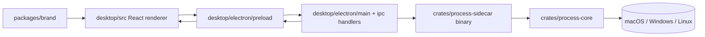

# refactor: Migrate desktop runtime from Tauri to Electron

## Overview

将 `desktop/` 从 **Tauri 2 宿主**重构为 **Electron 宿主**，同时尽量保留已经完成的 React/Vite 前端 UI、品牌资源与 `crates/process-core/` 的进程领域逻辑。

这次不是重做产品界面，而是**替换桌面运行时与打包链路**：

- 去掉 `desktop/src-tauri/` 与 `@tauri-apps/api`
- 引入 Electron 的 `main / preload / renderer` 三层结构
- 保留现有 `desktop/src/` UI 结构与活动监视器式界面
- 让 Rust `process-core` 通过 **sidecar binary** 而不是 Tauri command 被复用

本计划会覆盖宿主切换、IPC 重建、原生 sidecar 打包、开发命令与文档更新。

## Problem Frame

当前 `desktop/` 已经围绕 Tauri 建立了完整骨架，并完成了：

- 真实进程列表 / 结束进程能力
- 基于 Rust `process-core` 的进程模型
- 更接近活动监视器的主 UI

但用户现在已明确决定：**桌面端不再继续使用 Tauri，而改为 Electron**。

因此新的核心问题不是“如何继续做功能”，而是：

1. **如何替换宿主层而尽量不推倒 UI**
2. **如何保留现有 Rust 进程核心，避免把系统能力全部重写成 Node/TS**
3. **如何在 Electron 下重新建立安全 IPC、开发体验与跨平台打包**

## Requirements Trace

- R1. `desktop/` 改为 Electron 运行时，面向 macOS / Windows / Linux 继续发布。
- R2. 现有“列出进程 -> 结束进程 -> 刷新反馈”主链路必须在 Electron 下继续成立。
- R3. 不再依赖 Tauri command / `@tauri-apps/api`。
- R4. 前端 UI 尽量保持现有结构，不因为宿主切换而重写整套页面。
- R5. 系统能力仍应集中在原生层，不把关键进程逻辑退回纯前端。
- R6. 新架构不应另外开启 HTTP 端口做前后端通讯，主通信路径应是 Electron IPC。
- R7. 多模块仓库结构继续成立：`desktop/` 为桌面主模块，`packages/brand/` 继续承载公共资源，Rust 核心保持独立复用。
- R8. 需重新建立开发、构建、打包与签名基线，并保留当前 macOS 开发阶段 ad-hoc 的工程约束。

## Scope Boundaries

- 不重做已完成的活动监视器式 UI 交互设计。
- 不在这轮把进程核心完全改写成 TypeScript / Node.js。
- 不在这轮同时引入托盘、自动更新、开机启动。
- 不在这轮恢复或扩展移动端方案。
- 不做任务管理器级别的新监控指标设计；只保证现有字段链路在 Electron 下继续可用。

## Context & Research

### Relevant Code and Current Patterns

- `desktop/src/`：现有 React + Vite UI，已经形成活动监视器式表格与详情区。
- `desktop/src/lib/desktopRuntime.ts`：当前 runtime 检测与 bootstrap 入口，仍是 Tauri 语义。
- `desktop/src/features/processes/api.ts`：当前通过 `@tauri-apps/api/core.invoke` 调用宿主。
- `desktop/src/features/processes/useProcesses.ts`：前端刷新 / 结束进程主状态流，适合作为宿主切换后的保留层。
- `crates/process-core/`：已实现并测试通过的进程列表 / 结束进程领域能力。
- `desktop/src-tauri/`：当前 Tauri command 注册、打包配置与窗口配置所在位置，将被 Electron 宿主替换。

### Institutional Learnings

- 当前未发现 `docs/solutions/` 下与 Electron / Tauri / sidecar 相关的可复用历史方案。
- 当前未发现必须继承的桌面端事故文档或 critical patterns。

### External References

- Electron 官方安全建议：preload 中通过 `contextBridge` 暴露最小 API，不直接暴露 `ipcRenderer`。
- Electron 官方 IPC 教程：推荐 `ipcMain.handle` + `ipcRenderer.invoke` 作为 request/response 模式。
- Electron Forge 官方 Vite 插件文档：当前仍标注为实验性，不宜作为这次宿主重构的稳定基座。
- electron-builder 文档：`extraResources` 适合打包原生 sidecar，macOS 可通过 `mac.binaries` 处理额外二进制签名。

## System-Wide Impact

- **前端开发者**：继续在 `desktop/src/` 工作，但运行时桥从 Tauri 改为 Electron preload API。
- **桌面宿主层**：从 Rust 宿主切换为 TypeScript/Node 宿主，窗口生命周期、菜单、打包都迁移到 Electron。
- **Rust 领域层**：`crates/process-core/` 保留，但调用方式从内嵌 command 改成 sidecar binary。
- **发布链路**：从 Tauri bundle 转为 Electron 打包工具链，macOS 额外二进制签名路径需要重建。

## Key Technical Decisions

- **桌面运行时正式切换到 Electron，但前端 renderer 尽量保持现状。**
  - 理由：用户明确要求放弃 Tauri；现有 React/Vite UI 已经成型，重构重点应集中在宿主层而不是页面层。

- **Electron 采用标准三层边界：`main` / `preload` / `renderer`。**
  - 理由：这是 Electron 官方推荐的安全模型；renderer 不应直接拿到 Node / Electron 原语。

- **Electron 前后端通信采用 `ipcMain.handle` + preload `contextBridge` + renderer typed wrapper`，不开放 HTTP 端口。**
  - 理由：当前产品是本地桌面工具，不需要额外本地服务端口；这也与 Tauri command 的调用心智最接近，便于迁移。

- **保留 `crates/process-core/`，新增 Rust sidecar binary，而不是把进程能力重写成 Node。**
  - 理由：现有 Rust 逻辑已完成真实字段、保护规则与测试；宿主切换不等于系统能力必须重写。相比 N-API 绑定，sidecar binary 更容易复用当前 crate，并更容易与 Electron 打包边界解耦。

- **sidecar 通过 stdout JSON 协议返回结果，Electron main 负责调用、超时、错误归一化。**
  - 理由：这能让 renderer 继续消费接近当前的 DTO，而 native helper 与 UI 解耦。

- **保留 `desktop/src/` 的“浏览器预览模式”。**
  - 理由：当前 renderer 已有 mock fallback，这对纯 UI 开发、测试和设计迭代很有价值，不应因为切换 Electron 就丢掉。

- **开发构建链路不以 Electron Forge Vite 插件为核心，而以现有 Vite renderer + 独立 Electron host build 为主。**
  - 理由：Electron 官方文档中 Forge Vite 插件仍标记为实验性；当前项目已有稳定 Vite renderer，优先保持 renderer 稳定，宿主构建独立处理。

- **桌面打包层优先按 electron-builder 设计。**
  - 理由：它对跨平台安装包、`extraResources` 与附带 native sidecar 的处理更直接，适合这次“Electron + Rust helper”的组合。

## Flow Analysis

### Primary Flow 1: 正常启动桌面应用

1. 用户启动 Electron 应用
2. Electron `main` 创建 `BrowserWindow`
3. `preload` 暴露安全桥 API
4. renderer 调用 `bootstrapState`
5. renderer 调用 `listProcesses`
6. main 调用 Rust sidecar
7. sidecar 调用 `process-core`
8. JSON 结果回到 renderer 并渲染表格

### Primary Flow 2: 结束进程

1. 用户在 renderer 选中一个进程
2. renderer 打开确认弹窗
3. 确认后调用 preload API
4. main 触发 `terminate` sidecar 命令
5. sidecar 返回成功或标准化错误
6. renderer 更新 notice / error，并刷新列表

### Critical Gaps Resolved by This Plan

- **宿主替换后 renderer 如何调用原生能力？**
  - 通过 preload 暴露最小 typed API，而不是直接暴露 `ipcRenderer`。

- **Rust 逻辑是否废弃？**
  - 否，保留并通过 sidecar binary 复用。

- **打包后如何找到 sidecar？**
  - 开发态与打包态分别做路径解析；产物通过 `extraResources` 进入 app `resources/`。

- **macOS 下 sidecar 是否需要额外签名？**
  - 是，计划明确要求打包层处理额外二进制签名，而不是只签 Electron 主 app。

## Open Questions

### Resolved During Planning

- **“el” 是否按 Electron 处理？**
  - 结论：是，本计划按 Electron 宿主制定。

- **是否顺势把 Rust 进程层一起改成 Node/TS？**
  - 结论：否，优先保留 `crates/process-core/`，只替换宿主接入方式。

- **是否通过本地 HTTP 服务替代 Tauri command？**
  - 结论：否，继续使用宿主内 IPC，不额外开启端口。

### Deferred to Implementation

- **sidecar CLI 的最终命令行形态**（子命令式还是单命令 + JSON stdin）
  - 原因：不影响宏观架构，可在实现时按测试便利性收敛。

- **Electron 开发期重启策略**（`nodemon` / `electronmon` / 其他 watch 方案）
  - 原因：这是工具体验问题，不改变模块边界。

- **打包配置最终采用独立配置文件还是 `desktop/package.json` 内联配置**
  - 原因：属于配置组织细节，不影响架构决策。

## High-Level Technical Design

> *This illustrates the intended approach and is directional guidance for review, not implementation specification.*

### Responsibility Split

- `desktop/src/`
  - 只负责界面、状态、筛选、确认、展示
  - 不直接知道 Electron 或 Rust 细节

- `desktop/electron/`
  - 负责 `BrowserWindow`、preload、安全桥、IPC handler、native path resolution

- `crates/process-sidecar/`
  - 负责把 `process-core` 暴露成可执行命令

- `crates/process-core/`
  - 继续负责真实进程领域逻辑与错误模型

## Implementation Units

- [ ] **Unit 1: 建立 Electron 宿主骨架并替换桌面模块入口**

  - Goal: 在 `desktop/` 下建立 Electron `main / preload` 结构，并替换当前 Tauri 宿主入口。
  - Requirements: R1, R3, R6, R7, R8
  - Dependencies: None
  - Files:
    - Modify: `desktop/package.json`
    - Modify: `desktop/README.md`
    - Create: `desktop/electron/main.ts`
    - Create: `desktop/electron/preload.ts`
    - Create: `desktop/electron/ipc/bootstrap.ts`
    - Create: `desktop/electron/ipc/channels.ts`
    - Create: `desktop/tsconfig.electron.json`
    - Create: `desktop/electron-builder.yml` (or equivalent config file)
    - Delete: `desktop/src-tauri/`
  - Test:
    - Create: `desktop/electron/ipc/bootstrap.test.ts`
  - Approach:
    - 以 Electron 主进程创建窗口，preload 暴露最小桥 API。
    - 先建立 `bootstrapState` 对等能力，保证 renderer 能无感切到 `electron` runtime。
    - Tauri 目录与配置在 Electron 宿主基础稳定后一次性删除。
  - Patterns to follow:
    - Electron 官方 preload / contextBridge / IPC 教程
  - Test scenarios:
    - Happy path — renderer 能读取到 `runtime: "electron"` 的 bootstrap 状态。
    - Error path — preload 缺席时 renderer 仍可回退到浏览器预览模式。
  - Verification:
    - `desktop/` 不再依赖 Tauri 启动入口。
    - Electron 主窗口能加载现有 renderer 页面。

- [ ] **Unit 2: 将 renderer 改造成宿主无关的 bridge 消费层**

  - Goal: 去掉 renderer 对 `@tauri-apps/api` 和 `__TAURI_INTERNALS__` 的依赖，改为消费统一桌面桥。
  - Requirements: R2, R3, R4, R6, R7
  - Dependencies: Unit 1
  - Files:
    - Modify: `desktop/src/lib/desktopRuntime.ts`
    - Modify: `desktop/src/features/processes/api.ts`
    - Modify: `desktop/src/features/processes/useProcesses.ts`
    - Modify: `desktop/src/vite-env.d.ts`
    - Modify: `desktop/src/App.test.tsx`
    - Create: `desktop/src/lib/desktopBridge.ts`
    - Create: `desktop/src/lib/desktopRuntime.test.ts`
    - Create: `desktop/src/features/processes/api.test.ts`
  - Approach:
    - 引入统一的 `window.appManagerDesktop`（命名可在实现时微调）桥接口。
    - renderer 只知道 `bootstrap / listProcesses / terminateProcess` 三类能力。
    - 沿用当前浏览器 mock fallback，保留纯 renderer 预览能力。
  - Patterns to follow:
    - 当前 `desktop/src/features/processes/useProcesses.ts`
    - 当前 `desktop/src/features/processes/api.ts`
  - Test scenarios:
    - Happy path — Electron bridge 存在时，renderer 走真实宿主 API。
    - Happy path — bridge 缺席时，renderer 继续使用 mock 数据。
    - Error path — 宿主返回标准化错误时，notice / error 状态与当前行为一致。
  - Verification:
    - renderer 层不再 import Tauri API。
    - 现有 UI 测试在浏览器模式下继续可运行。

- [ ] **Unit 3: 新增 Rust sidecar，并让 Electron main 复用 `process-core`**

  - Goal: 保留现有 Rust 进程逻辑，通过可执行 sidecar 而不是 Tauri command 提供能力。
  - Requirements: R2, R3, R4, R5, R7
  - Dependencies: Unit 1
  - Files:
    - Modify: `Cargo.toml`
    - Create: `crates/process-sidecar/Cargo.toml`
    - Create: `crates/process-sidecar/src/main.rs`
    - Create: `crates/process-sidecar/src/protocol.rs`
    - Create: `crates/process-sidecar/tests/protocol_smoke_test.rs`
    - Create: `desktop/electron/native/processSidecar.ts`
    - Create: `desktop/electron/ipc/processes.ts`
    - Modify: `crates/process-core/` (only if protocol shaping needs minor exports)
  - Approach:
    - sidecar 将 `list` / `terminate` 结果序列化为 JSON。
    - Electron main 负责调用 sidecar、区分开发态 / 打包态路径、处理超时和 stderr。
    - 现有 `ProcessItem` / `ProcessError` / `TerminateProcessResult` 继续作为主 DTO。
  - Patterns to follow:
    - 当前 `crates/process-core/src/lib.rs`
    - 当前 `desktop/src-tauri/src/commands/processes.rs`
  - Test scenarios:
    - Happy path — sidecar 能列出当前进程，并返回与当前 DTO 对齐的数据。
    - Happy path — sidecar 能结束允许结束的目标进程，并返回成功结果。
    - Error path — 当前进程 / 受保护进程仍返回 `protected`。
    - Error path — 不存在 PID 仍返回 `not_found`。
  - Verification:
    - Electron main 能通过 sidecar 完成 list / terminate。
    - `crates/process-core/` 无需因宿主切换而重写。

- [ ] **Unit 4: 建立 Electron 打包链路并处理 sidecar 资源布局**

  - Goal: 在 macOS / Windows / Linux 下建立 Electron 打包结构，并把 Rust sidecar 正确纳入产物。
  - Requirements: R1, R5, R8
  - Dependencies: Unit 1, Unit 3
  - Files:
    - Modify: `desktop/package.json`
    - Modify: `desktop/electron-builder.yml` (or equivalent)
    - Modify: `desktop/README.md`
    - Create: `desktop/scripts/` (if build hooks are needed)
  - Test:
    - Create: `desktop/electron/native/processSidecar.test.ts`
  - Approach:
    - renderer 继续用 Vite 构建。
    - Electron host 产物与 renderer 产物分开输出。
    - 通过 `extraResources` 带入 sidecar，并在 macOS 配置额外二进制签名路径。
    - 保留当前开发阶段 macOS ad-hoc / 开发签名策略，不把签名要求后退。
  - Patterns to follow:
    - electron-builder `extraResources`
    - electron-builder `mac.binaries`
  - Test scenarios:
    - Happy path — 打包态能从 `resources/` 找到 sidecar。
    - Error path — sidecar 缺失时主进程能返回可诊断错误，而不是 renderer 静默失败。
  - Verification:
    - 开发态与打包态都能解析 native helper 路径。
    - 打包配置已具备后续签名 / 分发扩展位。

- [ ] **Unit 5: 清理 Tauri 遗留物并更新仓库文档 / 命令约定**

  - Goal: 删除 Tauri 专属依赖与文档假设，让仓库对外只暴露 Electron 桌面架构。
  - Requirements: R3, R7, R8
  - Dependencies: Unit 1, Unit 2, Unit 4
  - Files:
    - Modify: `package.json`
    - Modify: `desktop/README.md`
    - Modify: `docs/plans/2026-07-22-001-feat-tauri-desktop-foundation-plan.md` (add superseded note if needed)
    - Modify: `docs/plans/2026-07-22-002-feat-activity-monitor-ui-redesign-plan.md` (note runtime assumption change if needed)
    - Delete: Tauri-only config / generated schemas / icons that are no longer referenced
  - Test:
    - none -- 以全量 build / smoke verification 为主
  - Approach:
    - 从 workspace 与桌面依赖中移除 Tauri。
    - README、开发命令、运行时说明统一改成 Electron 语义。
    - 已完成的 UI 计划保留，但注明其 IPC 假设已切换到 Electron。
  - Test scenarios:
    - Test expectation: none — 此单元主要是清理与文档对齐。
  - Verification:
    - 仓库默认桌面方案不再出现 Tauri 作为活跃实现依赖。
    - 新成员只看文档即可按 Electron 方式启动与理解项目。

## Risks & Notes

- Electron 的常驻资源开销高于 Tauri，这是明确接受的产品/工程取舍。
- sidecar 方案保住了现有 Rust 逻辑，但会把“打包 + 签名 + helper 路径解析”变成新的复杂点。
- preload 必须坚持最小暴露原则；不能把原始 `ipcRenderer`、Node API 或回调事件对象直接泄漏到 renderer。
- 当前 renderer 预览模式非常有价值，应保留；不要因为切换 Electron 而强迫所有 UI 开发都依赖桌面宿主。

## Verification Strategy

- `pnpm --dir desktop test`
- `pnpm --dir desktop build`
- `cargo test -p process-core`
- `cargo test -p process-sidecar`
- Electron 开发态手工烟测：
  - 应用启动
  - 进程列表加载
  - 搜索 / tab 切换
  - 结束进程确认与反馈
- 打包态烟测：
  - sidecar 可执行文件能被找到
  - 主链路在打包产物中仍成立
