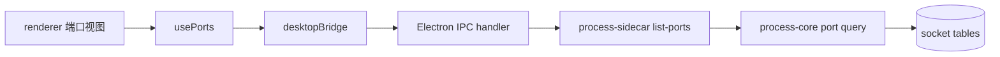

# feat: Add port occupancy management view

## Overview

为桌面端增加一个新的 **“端口”** 维度 tab，让用户可以在应用内直接查看当前被占用的监听端口，并定位到对应进程后执行结束动作。

这轮不是做完整网络监控，而是补齐“**哪个应用占了这个端口，我怎么快速干掉它**”这条高频排障链路。

目标结果：

- 顶部 tab 新增“端口”
- 列表展示当前监听中的 TCP / UDP 端口占用
- 支持按端口号、协议、进程名、PID 搜索
- 支持右键菜单直接结束对应进程
- 保持现有 Electron IPC + Rust sidecar 架构，不额外开启本地 HTTP 端口

## Problem Frame

当前桌面端已经能从 CPU / 内存 / 磁盘等维度查看进程并结束进程，但当用户遇到“某个端口被占用”时，现有界面没有直接入口：

- 用户无法通过端口号反查占用进程
- “网络”视图目前只是占位列，不能解决端口冲突排障
- 用户只能切回命令行用 `lsof`、`netstat` 或系统工具排查

需要新增一个对端口占用更直接的视图，把“找占用端口的应用 -> 结束它”这件事收进 App Manager 本身。

## Requirements Trace

- R1. 顶部监视维度新增 `端口` tab，而不是替换现有进程维度。
- R2. 端口视图必须能展示当前被占用的监听端口，并关联到所属进程。
- R3. 用户必须能通过端口号、协议、进程名、路径或 PID 搜索结果。
- R4. 用户必须能通过右键菜单直接结束端口所属进程。
- R5. 自身进程或受保护进程仍然不能被结束，保护规则与现有进程视图一致。
- R6. 端口数据获取继续走 Electron IPC + Rust sidecar，不新增本地服务端口。
- R7. 需要覆盖 macOS / Windows / Linux 的跨平台端口枚举能力。
- R8. 自动刷新、手动刷新、消息提示的体验应与现有进程视图保持一致。
- R9. 端口查询失败时，只影响端口视图本身，不应破坏其他进程视图。

## Scope Boundaries

- 不在这轮实现真实网络流量监控或带宽统计。
- 不在这轮实现“释放端口但不结束进程”的更细粒度 socket 操作。
- 不在这轮展示所有已建立连接；优先解决“监听 / 占用端口”的排障问题。
- 不重做现有 CPU / 内存 / 能耗 / 磁盘 / 网络 视图。
- 不在这轮引入管理员提权、系统服务管理或防火墙管理。

## Context & Research

### Relevant Code and Current Patterns

- `desktop/src/App.tsx`
  - 当前通过 `PROCESS_VIEW_ORDER` 驱动顶部 tab，并将所有视图都渲染为同一个 `ProcessList`。
- `desktop/src/features/processes/view-config.ts`
  - 当前 tab、列配置、默认排序都围绕 `ProcessItem` 单一数据模型组织。
- `desktop/src/features/processes/components/ProcessList.tsx`
  - 当前表格按“每行一个进程”建模，适合进程维度，但不适合“一个进程可能占多个端口”的关系。
- `desktop/src/features/processes/useProcesses.ts`
  - 已沉淀自动刷新、手动刷新、结束动作反馈等交互模式，可作为端口视图复用参考。
- `desktop/electron/ipc/processes.cts`
  - 当前已通过 IPC handler 暴露 `listProcesses`、`terminateProcess` 和右键菜单能力。
- `desktop/electron/native/processSidecar.cts`
  - 当前所有原生查询都通过 sidecar 二进制执行并解析 JSON 结果。
- `crates/process-core/src/query.rs`
  - 当前进程清单由 `sysinfo` 提供，适合进程维度，但没有端口占用信息。
- `crates/process-sidecar/src/main.rs`
  - 当前 sidecar 已有 `list` 与 `terminate` 命令模式，适合扩展新的 `list-ports` 命令。

### Institutional Learnings

- 当前 `docs/solutions/` 中没有与端口占用管理直接相关的历史方案可复用。
- 当前已沉淀的 release 运维文档与本功能无直接实现耦合。

### External References

- `netstat2` 官方文档（`docs.rs/netstat2/0.11.2`）提供跨平台 socket 枚举能力：
  - `get_sockets_info(AddressFamilyFlags, ProtocolFlags)`
  - 返回 `SocketInfo.associated_pids`
  - TCP 可通过 `TcpState::Listen` 识别监听端口
- 这比在 Rust / Node 中分别 shell 出 `lsof`、`ss`、`netstat` 再解析文本更稳定，也更适合继续复用现有 sidecar 边界。

## System-Wide Impact

- **Renderer UI**：不再是假设所有 tab 都对应同一种 `ProcessItem` 列表，需要支持端口视图的独立数据模型与表格组件。
- **Electron IPC**：需要新增端口查询命令，并让端口行也能复用结束进程上下文菜单。
- **Rust 原生层**：`process-core` 需要新增跨平台端口枚举逻辑，并将 socket 与进程元数据关联。
- **测试层**：需要补一组“监听 socket -> 在端口视图可见 -> 结束所属进程”的端到端近似测试链路。

## Key Technical Decisions

- **新增独立 `端口` tab，不复用当前 `网络` 占位视图。**
  - 理由：用户明确提到要“加一个端口的”，而不是把未来网络流量概念改名。保留 `网络` 作为后续真实流量视图更清晰。

- **端口视图采用独立数据模型 `PortBindingItem`，不把端口字段硬塞进 `ProcessItem`。**
  - 理由：端口与进程是“一对多”关系。一个进程可能监听多个端口；若仍以 `ProcessItem` 为中心，会让排序、搜索、展示与后续扩展都变得别扭。

- **端口视图每行表示一个“端口占用记录”，而不是一个进程摘要。**
  - 理由：用户排查端口冲突时，入口信息是端口号 / 协议 / 地址，而不是先知道进程名。

- **端口查询能力继续下沉到 Rust `process-core`，新增 `netstat2` 依赖。**
  - 理由：当前原生系统能力已经集中在 Rust；继续沿用 sidecar + JSON 结果比在 Electron main 中按平台分支 shell 系统命令更一致。

- **第一版只展示监听中的 TCP 和已绑定的 UDP 本地端口。**
  - 理由：这正对应“端口被占用”的核心问题；已建立连接不是本轮必须范围。

- **同一个 socket 如关联多个 PID，则展开为多条记录。**
  - 理由：结束动作是以 PID 为单位的。行级展开比在一行中承载多个 PID 更利于搜索、排序和右键结束。

- **端口视图继续复用现有“结束进程”动作，而不是新增“关闭端口”动作。**
  - 理由：用户目标是“干掉应用”，现有 terminate 语义已经满足，不需要额外创造新的原生操作边界。

- **自动刷新周期与顶部全局刷新配置保持一致。**
  - 理由：端口占用变化属于运行时状态，应与进程列表保持相同刷新心智，避免出现某个 tab 仍然是旧数据。

## Flow Analysis

### Primary Flow 1: 通过端口查找占用进程

1. 用户切换到 `端口` tab
2. renderer 触发端口列表加载
3. Electron main 调用 sidecar `list-ports`
4. sidecar 从 Rust `process-core` 返回端口占用记录
5. renderer 展示协议、地址、端口、进程名、PID、用户、路径
6. 用户输入端口号或进程名筛选结果

### Primary Flow 2: 结束占用端口的应用

1. 用户在端口行上右键
2. Electron 弹出上下文菜单
3. 用户点击“结束”
4. renderer 复用当前 terminate 流程
5. 成功后自动刷新端口列表与进程列表状态

### Error and Edge Cases

- 端口记录查到了 PID，但无法在 `sysinfo` 进程快照中补齐名称 / 路径
  - 应展示 PID 与占位文案，而不是整页失败
- 某条记录关联的是当前 App 自身 PID
  - 应标记为受保护，不允许结束
- 端口枚举失败
  - 应只在端口视图显示错误态与重试入口
- 某端口在刷新瞬间已释放
  - 结束动作应返回“not found”并走现有错误提示

## Open Questions

### Resolved During Planning

- **要不要直接复用现有 `网络` tab？**
  - 结论：不要，新增独立 `端口` tab。

- **要不要把端口信息作为 `ProcessItem` 的一个附属字段？**
  - 结论：不要，端口视图应有独立数据模型。

- **原生层是 shell 系统命令还是继续走 Rust？**
  - 结论：继续走 Rust，避免在 Electron main 中写多平台命令解析分支。

### Deferred to Implementation

- **端口列是否默认只显示本地地址，还是显示 `localAddr:port` 完整组合**
  - 原因：属于展示文案细节，可在实现与 UI 预览中快速收敛。

- **端口视图默认排序是按端口号还是按进程名**
  - 原因：需要结合实际数据观感决定，但不会改变数据边界。

## High-Level Technical Design

> *This illustrates the intended approach and is directional guidance for review, not implementation specification.*

### Responsibility Split

- `crates/process-core/`
  - 负责端口占用枚举、PID 关联、受保护规则复用、结果排序

- `crates/process-sidecar/`
  - 负责将端口查询能力暴露成新命令，并输出标准 JSON

- `desktop/electron/`
  - 负责新增 `listPorts` IPC 能力，以及端口行的右键菜单桥接

- `desktop/src/features/ports/`
  - 负责端口视图自己的类型、API、刷新 hook、表格组件、格式化逻辑

- `desktop/src/App.tsx`
  - 负责 tab 切换、统一搜索框、统一刷新策略与视图间切换

## Implementation Units

- [ ] **Unit 1: 在 Rust 原生层新增端口占用查询能力**

  - Goal: 让 `process-core` 能跨平台返回端口占用记录，并复用现有保护规则。
  - Requirements: R2, R5, R7
  - Dependencies: None
  - Files:
    - Modify: `crates/process-core/Cargo.toml`
    - Modify: `crates/process-core/src/lib.rs`
    - Modify: `crates/process-core/src/model.rs`
    - Modify: `crates/process-core/src/query.rs`
    - Create: `crates/process-core/src/ports.rs`
    - Modify: `crates/process-sidecar/src/main.rs`
    - Create: `crates/process-core/tests/ports_query_smoke_test.rs`
  - Test:
    - Create: `crates/process-core/tests/ports_query_smoke_test.rs`
  - Approach:
    - 引入 `netstat2`
    - 枚举 IPv4 / IPv6、TCP / UDP sockets
    - 过滤 TCP `Listen` 与 UDP 已绑定本地端口
    - 通过 PID 关联当前进程快照，补齐名称、路径、用户、受保护状态
    - 将多 PID socket 展开为多条记录
  - Patterns to follow:
    - `crates/process-core/src/query.rs`
    - `crates/process-core/src/terminate.rs`
    - `crates/process-sidecar/src/main.rs`
  - Test scenarios:
    - Happy path — 当前测试进程绑定一个 TCP 监听端口后，查询结果能返回对应 PID 和端口号
    - Happy path — 当前测试进程绑定一个 UDP 本地端口后，查询结果能返回对应 PID 和端口号
    - Edge case — 当前进程占用端口时，记录应被标记为受保护、不可结束
    - Edge case — 无法补齐进程元数据时，结果仍保留 PID 与端口信息
  - Verification:
    - sidecar 新命令能输出稳定 JSON
    - macOS / Linux / Windows 目标平台编译链路保持可构建

- [ ] **Unit 2: 扩展 Electron bridge 与 IPC，暴露端口查询能力**

  - Goal: 在 renderer 中新增 `listPorts` 调用能力，并让端口行可以复用结束动作。
  - Requirements: R4, R6, R8, R9
  - Dependencies: Unit 1
  - Files:
    - Modify: `desktop/electron/ipc/channels.cts`
    - Modify: `desktop/electron/ipc/processes.cts`
    - Modify: `desktop/electron/preload.cts`
    - Modify: `desktop/electron/native/processSidecar.cts`
    - Modify: `desktop/src/lib/desktopBridge.ts`
    - Create: `desktop/src/features/ports/api.ts`
    - Create: `desktop/src/features/ports/types.ts`
    - Create: `desktop/src/features/ports/api.test.ts`
  - Test:
    - Create: `desktop/src/features/ports/api.test.ts`
  - Approach:
    - sidecar bridge 新增 `listPortsFromSidecar`
    - preload 暴露 `listPorts`
    - 右键菜单沿用按 PID terminate 的动作语义
    - 端口查询错误复用现有 command error 结构
  - Patterns to follow:
    - `desktop/electron/ipc/processes.cts`
    - `desktop/electron/native/processSidecar.cts`
    - `desktop/src/features/processes/api.ts`
  - Test scenarios:
    - Happy path — bridge 存在时，`listPorts` 能把 renderer 请求转发到 preload
    - Error path — sidecar 返回 command error 时，renderer 能收到标准化错误对象
  - Verification:
    - Electron renderer 可无额外端口直接获取端口占用数据
    - 现有 `listProcesses` / `terminateProcess` 行为不回归

- [ ] **Unit 3: 新增端口视图的前端状态、表格与 tab 集成**

  - Goal: 在现有桌面 UI 中接入 `端口` tab，并提供搜索、排序、空态、错误态与右键结束动作。
  - Requirements: R1, R2, R3, R4, R8, R9
  - Dependencies: Unit 2
  - Files:
    - Modify: `desktop/src/App.tsx`
    - Modify: `desktop/src/components/icons.tsx`
    - Modify: `desktop/src/styles/base.css`
    - Modify: `desktop/src/features/processes/components/ProcessToolbar.tsx`
    - Modify: `desktop/src/features/processes/view-config.ts`
    - Create: `desktop/src/features/ports/usePorts.ts`
    - Create: `desktop/src/features/ports/view-config.ts`
    - Create: `desktop/src/features/ports/components/PortList.tsx`
    - Create: `desktop/src/features/ports/mockPorts.ts`
    - Create: `desktop/src/features/ports/usePorts.test.tsx`
    - Create: `desktop/src/features/ports/components/PortList.test.tsx`
  - Test:
    - Create: `desktop/src/features/ports/usePorts.test.tsx`
    - Create: `desktop/src/features/ports/components/PortList.test.tsx`
  - Approach:
    - 新增 `ports` 视图 ID
    - 端口视图使用独立 hook 和独立表格组件
    - 搜索框文案从“只搜进程”提升为可覆盖端口视图的通用文案
    - 端口 tab 仍接入现有 toast、自动刷新、选中态和上下文菜单交互
  - Patterns to follow:
    - `desktop/src/features/processes/useProcesses.ts`
    - `desktop/src/features/processes/components/ProcessList.tsx`
    - `desktop/src/App.tsx`
  - Test scenarios:
    - Happy path — 切换到端口 tab 后能加载并渲染端口占用列表
    - Happy path — 输入端口号或协议能筛选结果
    - Happy path — 右键端口行后能触发结束动作
    - Error path — 端口列表加载失败时展示重试态，不影响其他 tab
    - Edge case — 当前无端口记录时展示“没有监听端口”空态
  - Verification:
    - UI 中可见新的 `端口` tab
    - 用户可以在应用内通过端口定位并结束进程

## Dependencies & Sequencing

1. **先做 Rust 端口查询能力**，因为 renderer 需要稳定 DTO 与 sidecar 命令边界。
2. **再补 Electron bridge / IPC**，把原生能力接到桌面运行时。
3. **最后接 UI 与交互**，避免先在前端造假接口后再返工。

## Risks & Mitigations

- **风险：不同平台的 socket / PID 关联结果不完全一致**
  - 缓解：第一版只保证“尽量返回可定位 PID 的监听端口”；查不到进程元数据时保持降级展示而不是整页失败。

- **风险：端口与进程的一对多关系会让现有 `ProcessList` 复用成本过高**
  - 缓解：直接接受独立 `PortList` 组件，而不是强行把所有视图压进同一个表格模型。

- **风险：高频自动刷新下端口枚举成本偏高**
  - 缓解：先复用当前刷新周期；如果后续观测到卡顿，再单独调优端口视图刷新节奏。

## Verification Strategy

- Rust 测试覆盖 TCP / UDP 监听端口发现
- renderer 测试覆盖端口 tab 渲染、筛选、错误态
- Electron 手动验证：
  - 启动一个临时监听端口
  - 在 `端口` tab 搜到它
  - 右键结束对应进程
  - 端口记录从列表消失
