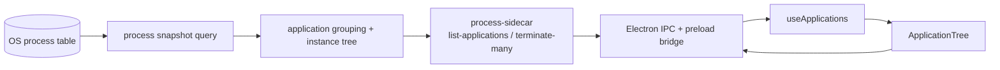

# feat: 增加应用树视图

## Overview

为桌面端新增一个用户可见的 **“应用”** tab，用树层级方式展示：

- 应用组
- 应用实例
- 实例下的子进程

目标不是替换当前 CPU / 内存 / 能耗 / 磁盘 / 网络 / 端口这些平铺视图，而是补齐一个更适合“**一键结束一整组多开实例**”的操作入口。

这轮完成后，用户应能在应用内直接完成这条链路：

1. 切到 `应用`
2. 找到某个应用组（例如一堆 Chrome for Testing）
3. 展开查看实例与子进程
4. 右键选择结束整个应用、单个实例或单个进程
5. 获得统一的确认、反馈与刷新结果

## Problem Frame

当前桌面端已经具备两类能力：

- **平铺进程视图**：按 CPU / 内存 / 能耗 / 磁盘 / 网络维度查看单个进程
- **端口视图**：按端口占用记录定位单个进程并结束

但当用户面对“同一个应用被多开，且带出一串 helper / renderer / child process”时，现有模型不够高效：

- 用户只能一条一条结束 PID
- 无法从“应用”角度聚合多个实例
- 无法在一个树里看清父子进程关系

这正对应 origin 中遗留的 deferred question：运行中“应用”的定义，不应再停留在纯进程级列表，而要补上一个**按应用聚合、按实例展开、按子进程下钻**的视图（见 origin: `docs/brainstorms/2026-07-22-cross-platform-desktop-tech-selection-requirements.md`）。

## Requirements Trace

- R1. 顶部监视维度新增 `应用` tab，不替换现有进程指标 tab 与 `端口` tab。
- R2. `应用` 视图必须按 **应用 -> 实例 -> 子进程** 的树结构展示运行中对象。
- R3. 同一应用的多开实例必须聚合到同一个应用组内，便于统一操作。
- R4. 用户必须能通过右键菜单分别结束：整个应用组、单个实例、单个进程。
- R5. 批量结束动作必须继续遵守现有保护规则；当前应用自身或不可结束项不能被误杀。
- R6. 搜索、自动刷新、确认弹窗、消息提示要与现有桌面体验一致，不引入额外心智。
- R7. 应用树加载失败时，只影响 `应用` tab，不破坏现有进程 / 端口视图。
- R8. 第一版分组语义基于跨平台可获得的 **OS 进程信息**，不依赖窗口枚举、辅助功能 API 或额外系统权限。
- R9. 当前平铺进程视图继续保留，作为底层资源观察与精确 PID 操作入口。

## Scope Boundaries

- 不在这轮实现窗口级聚合或按前台窗口分组。
- 不在这轮引入“温和退出 / 强制结束”双动作模型，仍以当前结束语义为主。
- 不在这轮实现管理员提权、系统关键服务管理或更高权限的结束策略。
- 不把现有 CPU / 内存 / 端口视图改造成树；它们继续保持平铺表格。
- 不在这轮实现跨设备同步、历史快照或应用使用统计。

## Context & Research

### Relevant Code and Patterns

- `desktop/src/App.tsx`
  - 当前通过 `MONITOR_VIEW_ORDER` 组织顶部 tab，并在同一壳层中编排搜索、刷新、toast、更新弹窗与结束确认。
- `desktop/src/features/processes/components/ProcessList.tsx`
  - 当前列表组件是纯平铺 `<table>` 行模型，不适合直接承载树层级节点。
- `desktop/src/features/ports/components/PortList.tsx`
  - 端口视图证明了“新增独立 tab + 独立数据模型 + 复用结束动作”的扩展路径已经成立。
- `desktop/src/features/processes/useProcesses.ts`
  - 已沉淀自动刷新、结束动作反馈、错误隔离等交互模式，可作为 `应用` 视图 hook 的直接参考。
- `desktop/src/features/processes/components/ProcessToolbar.tsx`
  - 当前搜索栏与计数展示已是跨视图可复用模式。
- `desktop/electron/ipc/processes.cts`
  - 当前 Electron main 已统一承接 `listProcesses`、`listPorts`、`terminateProcess` 与右键菜单桥接。
- `desktop/electron/preload.cts`
  - 当前 preload 通过 `contextBridge` 暴露 typed desktop bridge，是新增 `listApplications` / 批量结束 API 的既有入口。
- `desktop/electron/native/processSidecar.cts`
  - 当前所有原生查询都通过 sidecar stdout JSON 返回，适合继续新增 `list-applications` 与批量结束命令。
- `crates/process-core/src/model.rs`
  - 当前 `ProcessItem` 只覆盖平铺视图字段，尚未暴露父子关系或应用聚合 DTO。
- `crates/process-core/src/query.rs`
  - 当前原生进程清单已具备 `pid`、`path`、`start_time_seconds` 等树构建基础字段，但没有 parent / grouping 层。
- `docs/plans/2026-07-22-001-feat-tauri-desktop-foundation-plan.md`
  - 早期明确把“窗口级聚合、应用树、子进程展开”排除在 MVP 外；本计划就是把这块补回来。
- `docs/plans/2026-07-23-004-feat-port-occupancy-management-plan.md`
  - 最近一次跨层扩展已经证明：新增独立视图时，维持 Rust sidecar + Electron IPC + renderer feature module 的路径最稳。

### Institutional Learnings

- `docs/solutions/` 中当前只有 release 运维相关文档：
  - `docs/solutions/workflow-issues/github-release-operations-2026-07-23.md`
- 未发现与进程树、应用聚合、批量结束相关的历史方案。
- 未发现 `docs/solutions/patterns/critical-patterns.md`。
- 结论：本次规划主要依赖当前仓库已有实现模式，不需要继承特定事故修复方案。

### External References

- 本次未额外引入外部资料。
- 原因：当前仓库已经有足够直接的本地模式（独立 feature module、sidecar 命令扩展、IPC bridge、列表/右键/刷新链路），本计划优先沿用本地架构约束。

## Key Technical Decisions

- **用户可见的新视图命名为 `应用`，而不是把现有平铺视图重命名。**
  - 理由：用户已经明确希望“应用”承担树层级聚合语义，同时保留现有平铺 PID 视图用于资源观察与精确操作。

- **应用分组语义采用“基于 OS 进程信息的应用聚合”，不是窗口级聚合。**
  - 理由：当前跨平台可稳定获取的是进程树、可执行路径、启动时间等字段；窗口枚举会明显放大平台差异与权限复杂度，不适合作为这一轮前提。

- **应用树数据由 Rust `process-core` 直接产出专用 DTO，而不是让 renderer 从 `ProcessItem[]` 现场拼树。**
  - 理由：应用身份归一化、父子关系构建、实例边界判断都属于系统领域逻辑；放在 native 层更利于跨平台一致性和后续复用。

- **应用身份优先由标准化路径推导：macOS 以 `.app` bundle 为主，Windows / Linux 以可执行路径族为主，缺失路径时退化到进程名。**
  - 理由：这能把同一应用的 helper / renderer / 子进程尽量归到同一组，同时避免第一版就依赖窗口标题、签名信息或额外权限。

- **实例边界定义为“同一应用组内的顶层根进程”，子进程通过 parent PID 链挂到对应实例下。**
  - 理由：这正对应“同一应用可多开”的目标，也能让批量结束动作自然映射到“整组”或“单实例”。

- **结束整组 / 单实例的动作走新的批量结束 native API，不在 renderer 中循环调用单 PID 结束。**
  - 理由：批量动作需要统一保护校验、统一结果汇总、统一刷新时机；renderer 串行循环既脆弱，也难以给出一致反馈。

- **`应用` 视图采用独立组件与 hook，不强行复用当前平铺表格组件。**
  - 理由：树层级的展开/折叠、节点缩进、祖先保留搜索结果与多层右键菜单，已经超出 `ProcessList` / `PortList` 的平铺行模型。

- **树节点稳定标识采用“应用 key / 实例 root PID + start time / 进程 PID + start time”组合。**
  - 理由：自动刷新存在 PID 复用与节点重排风险，稳定 id 是保持展开态、选中态与动画连续性的前提。

- **应用树结束动作成功后，需要同步刷新应用、进程、端口三个数据源。**
  - 理由：同一批进程结束后，三类视图都会立即失真；只刷新当前 tab 会制造跨视图残留。

## Flow Analysis

### Primary Flow 1: 浏览并定位某个多开应用

1. 用户切换到 `应用` tab
2. renderer 调用 `listApplications`
3. Rust 侧返回应用组 -> 实例 -> 子进程树
4. 用户可展开应用组，查看实例数量与子进程结构
5. 用户可通过搜索命中应用名、路径、PID、子进程名
6. 搜索结果保留匹配节点的祖先链，而不是打平成孤立进程

### Primary Flow 2: 一键结束整个应用组

1. 用户在应用组节点上右键
2. Electron 弹出原生菜单，展示“结束此应用全部实例”等动作
3. 用户确认后，renderer 调用批量结束 API
4. native 层按受保护规则过滤并执行结束
5. renderer 展示成功 / 部分失败 / 全失败反馈
6. 应用、进程、端口三个视图同步刷新

### Primary Flow 3: 只结束某一个实例

1. 用户展开应用组
2. 在某个实例节点右键
3. 选择“结束此实例”
4. 仅该实例下的 root process 与 descendants 被纳入本次结束列表
5. 其他实例继续保留在应用组中

### Edge Cases and Gaps Closed by This Plan

- 搜索命中的是子进程，而不是应用组名
  - 处理：保留祖先链并自动展开匹配路径
- 自动刷新时实例消失或被重建
  - 处理：用稳定 id 尽量保留展开态；不存在的节点在刷新后自动清理
- 批量结束期间部分 PID 已退出
  - 处理：native 返回逐项结果，renderer 汇总为单次反馈，不因单个失败中断整批
- 某组内包含当前 App 自身进程
  - 处理：保持 protected / canTerminate 规则，不暴露危险动作或在批量结束时自动拦截

## Open Questions

### Resolved During Planning

- **树层级视图用户名称应该叫“应用”还是“进程”？**
  - 结论：叫 `应用`；现有平铺 PID 视图继续承担“进程”语义。

- **这轮要不要把现有进程表格直接改成树？**
  - 结论：不要，新建独立 `应用` 视图。

- **应用树是 renderer 现拼，还是 native 直接产出？**
  - 结论：由 Rust `process-core` 直接产出专用树 DTO。

- **整组 / 实例结束动作是复用单 PID IPC，还是新增批量能力？**
  - 结论：新增批量结束 native API，并保留现有单 PID API 兼容平铺视图。

### Deferred to Implementation

- **Windows / Linux 上“可执行路径族”的标准化细则是否需要针对某些 helper 名称做额外特判。**
  - 原因：这取决于真实样本数据，但不改变“应用组由 native 统一归一化”的总体架构。

- **应用树默认展开策略是全折叠、保留上次展开状态，还是首组默认展开。**
  - 原因：属于最终交互细节，可在实现预览中收敛，但不会改变数据模型与跨层接口。

- **批量结束反馈文案是强调成功数量，还是强调失败数量。**
  - 原因：属于产品措辞细节，可在实现时结合实际返回结构确定。

## High-Level Technical Design

> *This illustrates the intended approach and is directional guidance for review, not implementation specification. The implementing agent should treat it as context, not code to reproduce.*

### Responsibility Split

- `crates/process-core/`
  - 负责原始进程快照、应用身份归一化、实例分组、子进程树构建、批量结束保护校验

- `crates/process-sidecar/`
  - 负责新增 `list-applications` / `terminate-many` 命令并输出标准 JSON

- `desktop/electron/`
  - 负责 typed IPC、原生右键菜单动作、批量结束结果桥接

- `desktop/src/features/applications/`
  - 负责应用树数据获取、搜索过滤、展开状态、节点选择、视图级反馈

- `desktop/src/App.tsx`
  - 负责新 tab 集成、全局刷新节奏、结束确认与跨视图刷新编排

## Implementation Units

- [x] **Unit 1: 在 Rust 原生层建立应用树模型与批量结束能力**

**Goal:** 让 `process-core` 能基于当前进程快照返回应用组树，并支持批量结束目标 PID 集合。

**Requirements:** R2, R3, R4, R5, R8

**Dependencies:** None

**Files:**
- Modify: `crates/process-core/src/lib.rs`
- Modify: `crates/process-core/src/model.rs`
- Modify: `crates/process-core/src/query.rs`
- Modify: `crates/process-core/src/terminate.rs`
- Create: `crates/process-core/src/applications.rs`
- Modify: `crates/process-sidecar/src/main.rs`
- Create: `crates/process-core/tests/application_tree_fixture_test.rs`
- Modify: `crates/process-core/tests/process_core_smoke_test.rs`

**Approach:**
- 先把当前平铺进程快照抽成可复用的内部原始模型，补齐 parent PID、稳定 identity 所需字段。
- 在 `applications.rs` 中完成三层构建：
  - 应用组：同一标准化应用 key
  - 实例：同一应用组内的顶层 root process
  - 子进程：沿 parent PID 链挂到实例树
- 应用 key 归一化逻辑优先复用 `path` 与 `name`，不要让 renderer 自己猜测。
- 批量结束接口接收一组 PID，由 native 统一做：
  - protected 校验
  - 去重
  - 执行顺序整理
  - 逐项结果汇总

**Execution note:** 先用 fixture / synthetic snapshot 覆盖分组器，再把真实查询结果接入树 DTO。

**Patterns to follow:**
- `crates/process-core/src/query.rs`
- `crates/process-core/src/terminate.rs`
- `crates/process-core/src/ports.rs`
- `crates/process-sidecar/src/main.rs`

**Test scenarios:**
- Happy path — 同一 macOS `.app` bundle 下的多个进程被归到同一应用组。
- Happy path — 同一应用组内两个不同 root process 被识别为两个实例。
- Happy path — 子进程会挂到对应实例节点，而不是留在应用组平铺列表里。
- Edge case — 缺失 `path` 时，分组器退化到名称分组并保持稳定 id。
- Edge case — 父进程不存在或父进程不在同一应用组时，该进程应成为实例 root。
- Error path — 批量结束列表包含当前 App 自身 PID 时，该 PID 被拒绝且其余可结束项继续执行。
- Integration — `list-applications` sidecar 命令能输出稳定 JSON，`terminate-many` 能返回逐项结果摘要。

**Verification:**
- Rust 层能独立产出可重复的应用树结构。
- 新命令不会破坏既有 `list` / `list-ports` / `terminate` 行为。

- [x] **Unit 2: 扩展 Electron bridge、IPC 与原生右键菜单契约**

**Goal:** 在 Electron 层新增应用树查询、批量结束调用与多层级上下文菜单动作。

**Requirements:** R4, R5, R6, R7, R9

**Dependencies:** Unit 1

**Files:**
- Modify: `desktop/electron/ipc/channels.cts`
- Modify: `desktop/electron/ipc/processes.cts`
- Modify: `desktop/electron/native/processSidecar.cts`
- Modify: `desktop/electron/preload.cts`
- Modify: `desktop/src/lib/desktopBridge.ts`
- Create: `desktop/electron/ipc/applications.test.ts`

**Approach:**
- 新增 `listApplications` 与批量结束桥接方法。
- 扩展右键菜单 payload，使 renderer 可以按节点类型请求菜单：
  - 应用组
  - 实例
  - 进程
- 菜单事件回传不再只靠单个 `pid`，而是带上目标 kind、展示名称与待结束 PID 集合。
- 保持现有单 PID `terminateProcess` 与 process / port 右键菜单契约继续可用，避免回归。

**Patterns to follow:**
- `desktop/electron/ipc/processes.cts`
- `desktop/electron/native/processSidecar.cts`
- `desktop/electron/preload.cts`
- `desktop/src/lib/desktopBridge.ts`

**Test scenarios:**
- Happy path — preload 能把 `listApplications` 请求正确转发到 main IPC。
- Happy path — 应用组节点右键时，菜单包含“结束此应用全部实例”。
- Happy path — 实例节点右键时，菜单仅结束该实例范围内 PID。
- Edge case — 不可结束节点请求菜单时，危险动作为 disabled。
- Error path — sidecar 批量结束失败时，IPC 返回标准错误结构，不影响现有 process / port IPC。
- Integration — 旧的 `showProcessContextMenu` / `terminateProcess` 行为不回归。

**Verification:**
- renderer 能通过 typed bridge 调用新 API。
- 原生菜单动作能稳定回传足够信息驱动确认与执行。

- [x] **Unit 3: 建立 renderer `features/applications` 数据层与树过滤能力**

**Goal:** 为 `应用` tab 建立独立的类型、API、刷新 hook、树搜索和展开状态管理。

**Requirements:** R1, R2, R3, R6, R7

**Dependencies:** Unit 2

**Files:**
- Create: `desktop/src/features/applications/types.ts`
- Create: `desktop/src/features/applications/api.ts`
- Create: `desktop/src/features/applications/api.test.ts`
- Create: `desktop/src/features/applications/mockApplications.ts`
- Create: `desktop/src/features/applications/tree.ts`
- Create: `desktop/src/features/applications/tree.test.ts`
- Create: `desktop/src/features/applications/useApplications.ts`
- Create: `desktop/src/features/applications/useApplications.test.tsx`

**Approach:**
- 新建 `applications` feature module，保持与 `processes` / `ports` 同级。
- `useApplications` 复用现有自动刷新与反馈模式，但状态独立，不污染其他 tab。
- `tree.ts` 负责：
  - 稳定 node id 生成
  - 搜索命中判断
  - 匹配节点祖先保留
  - 刷新后展开态 / 选中态对齐
- 预览模式提供 mock tree，保证纯 UI 设计与测试不依赖 Electron 运行时。

**Patterns to follow:**
- `desktop/src/features/processes/useProcesses.ts`
- `desktop/src/features/ports/usePorts.ts`
- `desktop/src/features/processes/api.ts`
- `desktop/src/features/ports/api.ts`

**Test scenarios:**
- Happy path — hook 在 Electron runtime 下加载应用树，在 preview mode 下返回 mock tree。
- Happy path — 搜索应用名时返回对应应用组及其实例。
- Happy path — 搜索子进程名或 PID 时保留匹配节点的祖先链。
- Edge case — 自动刷新后，仍存在的展开节点保持展开，不存在的节点被移除。
- Error path — `listApplications` 失败时，只在应用视图产生错误态与反馈。
- Integration — hook 与树过滤逻辑组合后，可给 UI 提供稳定的 node id、选择态与批量目标集合。

**Verification:**
- 应用树数据层可单独测试。
- `应用` tab 不需要把树计算塞回 `App.tsx` 临时状态里。

- [x] **Unit 4: 集成 `应用` tab UI、确认弹窗与跨视图刷新**

**Goal:** 在主应用壳中接入 `应用` tab，完成树视图渲染、右键结束动作、确认弹窗与反馈整合。

**Requirements:** R1, R4, R5, R6, R7, R9

**Dependencies:** Unit 3

**Files:**
- Modify: `desktop/src/App.tsx`
- Modify: `desktop/src/App.test.tsx`
- Create: `desktop/src/features/applications/components/ApplicationTree.tsx`
- Create: `desktop/src/features/applications/components/ApplicationTree.test.tsx`
- Modify: `desktop/src/features/processes/components/ProcessToolbar.tsx`
- Modify: `desktop/src/features/processes/components/TerminateDialog.tsx`
- Modify: `desktop/src/features/processes/components/TerminateDialog.test.tsx`
- Modify: `desktop/src/styles/base.css`

**Approach:**
- 在 `App.tsx` 顶部 tab 中加入 `应用`，并接入 `useApplications`。
- `ApplicationTree` 采用树形 outline / row 结构，而不是再嵌套一个平铺卡片容器。
- 结束确认弹窗从“单进程文案”升级为“目标描述 + 数量摘要”的通用模式，覆盖：
  - 结束此应用
  - 结束此实例
  - 结束此进程
- 成功后统一刷新：
  - `applications.refresh("background")`
  - `processes.refresh("background")`
  - `ports.refresh("background", { reportFailure: activeView === "ports" })`
- 搜索框、计数文案和空态文案按 `应用` 视图单独适配，但继续沿用现有 toolbar 结构。

**Execution note:** 保留 `App.tsx` 当前行为测试，再增量加入 `应用` tab 场景，避免把现有进程 / 端口交互一起打碎。

**Patterns to follow:**
- `desktop/src/App.tsx`
- `desktop/src/features/processes/components/ProcessList.tsx`
- `desktop/src/features/ports/components/PortList.tsx`
- `desktop/src/features/processes/components/TerminateDialog.tsx`

**Test scenarios:**
- Happy path — 顶部 tab 出现 `应用`，切换后加载应用树。
- Happy path — 展开应用组后能看到实例和子进程层级。
- Happy path — 应用组 / 实例 / 进程右键分别触发正确的确认文案与目标集合。
- Edge case — 搜索只命中子进程时，父级自动保留并可见。
- Edge case — 自动刷新后当前选中应用仍存在时，不会被无故清空。
- Error path — 批量结束部分失败时，toast / 对话框反馈能区分失败而不假装全成功。
- Integration — 完成一次应用组结束后，进程视图与端口视图也同步反映最新状态。

**Verification:**
- 用户可以从 `应用` 视图完成“一键结束整组多开实例”的核心链路。
- 现有平铺进程 / 端口视图交互保持可用，没有被树视图回归破坏。

## System-Wide Impact

- **Interaction graph:** `App.tsx` 将首次同时编排三套运行时数据源：应用、进程、端口；结束动作不再只影响单一视图。
- **Error propagation:** 批量结束需要把 native 逐项结果上翻到 renderer，但最终反馈仍应收敛为一次用户可读消息。
- **State lifecycle risks:** 自动刷新可能让树节点瞬时消失、实例重建或 PID 复用；稳定 id 与刷新后对齐策略必须明确。
- **API surface parity:** 需要新增 `listApplications` / 批量结束接口，但现有 `listProcesses` / `listPorts` / `terminateProcess` 不应被替换。
- **Integration coverage:** 需要至少覆盖一次“应用树批量结束 -> 三视图刷新”的跨层场景，单元测试不足以完全证明。
- **Unchanged invariants:** 现有 CPU / 内存 / 能耗 / 磁盘 / 网络 / 端口视图仍然基于平铺数据模型工作；本计划不改变它们的排序、列结构与基础刷新策略。

## Risks & Dependencies

| Risk | Mitigation |
|------|------------|
| 跨平台分组启发式把同一应用拆散，或把不同应用误并 | 分组逻辑放在 native 层并以 fixture 测试约束；保留平铺进程视图作为兜底入口 |
| 批量结束出现部分失败，用户误以为整组已清空 | native 返回逐项结果摘要；renderer 统一展示成功/失败数量并强制刷新 |
| 自动刷新导致树展开态频繁抖动 | 使用稳定 node id，并把展开态维护在应用 feature 内而不是临时组件状态 |
| 右键菜单新契约回归现有进程/端口结束动作 | 保持旧单 PID IPC 契约兼容，并补一组 Electron bridge 回归测试 |

## Documentation / Operational Notes

- 本功能不要求修改 GitHub Actions、打包流程或发布链路。
- `desktop` 的 browser preview 模式应补一份 mock 应用树，便于后续 UI 打磨与视觉迭代。

## Sources & References

- **Origin document:** `docs/brainstorms/2026-07-22-cross-platform-desktop-tech-selection-requirements.md`
- Related plans:
  - `docs/plans/2026-07-22-001-feat-tauri-desktop-foundation-plan.md`
  - `docs/plans/2026-07-22-003-refactor-electron-desktop-runtime-plan.md`
  - `docs/plans/2026-07-23-004-feat-port-occupancy-management-plan.md`
- Related code:
  - `desktop/src/App.tsx`
  - `desktop/src/features/processes/components/ProcessList.tsx`
  - `desktop/src/features/ports/components/PortList.tsx`
  - `desktop/electron/ipc/processes.cts`
  - `desktop/electron/preload.cts`
  - `desktop/electron/native/processSidecar.cts`
  - `crates/process-core/src/model.rs`
  - `crates/process-core/src/query.rs`
  - `crates/process-core/src/terminate.rs`
